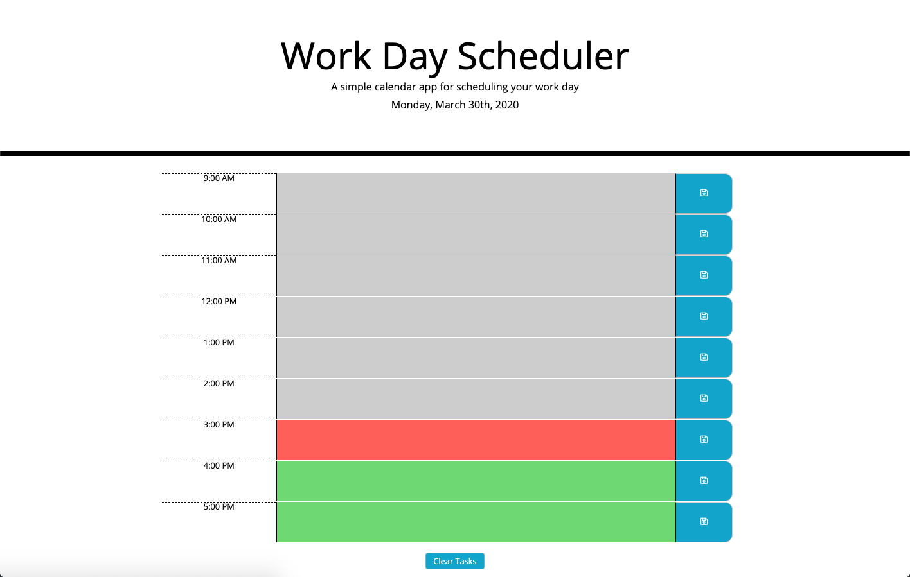

### Project Name

# Work Day Scheduler



> This application allows you to plan out your work day to stay ahead of the game.

---

### Table of Contents

Your section headers will be used to reference location of destination.

- [Description](#description)
- [How To Use](#how-to-use)
- [References](#references)
- [License](#license)
- [Contributors](#contributors)

---

## Description

This work day scheduler allows you to add tasks to certain hours of the standard work day. By clicking the save button for each time block it will save your tasks to your local computer that you will be able to come back to as your day progresses. 

This application also provides visual feedback that illistrates the time block based on the current time. 

- Grey: Past time blocks
- Red: Present time block
- Green: Future time blocks

If you need to you can clear your day of all tasks with a click of the button.

#### Technologies

- HTML 5
- CSS 3
- Javascript
- jQuery
- moment.js

---

## How To Use

Simiply load the application in your browser and away you go.

Enter your tasks in the colored areas for the desired time blocks. Then click the save button for that time block.

The colored areas are based on the current time.
- Grey: Past time blocks
- Red: Present time block
- Green: Future time blocks

To clear ALL tasks, click the 'Clear Tasks' button.

#### Installation

Open this link to view the Work Day Scheduler.

- [View Site](https://nvalline.github.io/day-planner/)

#### Code Samples

```javascript
$('.saveBtn').on('click', function (event) {
    textareaId = event.currentTarget.previousSibling.dataset.id;
    textareaValue = event.currentTarget.previousSibling.value.trim();
    if (textareaValue === '') {
        return
    } else if ($('textarea').hasClass('past')) {
        let reply = confirm('Are you sure you want to add a task to the past?');
        if (reply) {
            taskItems.push({ 'textareaId': textareaId, 'textareaValue': textareaValue });
        } else {
            $('textarea').val('');
            return
        }
    } else {
        taskItems.push({ 'textareaId': textareaId, 'textareaValue': textareaValue });
    }
    storeTasks();
})
```

```html
<header class="jumbotron">
    <h1 class="display-3">Work Day Scheduler</h1>
    <p class="lead">A simple calendar app for scheduling your work day</p>
    <p id="currentDay" class="lead"></p>
</header>
<!-- Day Planner Content -->
<div class="container"></div>
<!-- button to clear tasks -->
<button id="clearBtn" class="clearBtn">Clear Tasks</button>
```

```CSS
.clearBtn {
  position: relative;
  top: 20px;
  left: 50%;
  transform: translateX(-50%);
  margin-bottom: 40px;
  padding: 8px 15px;
  background-color: #06AED5;
  color: white;
  border-radius: 5px;
}

.clearBtn:hover {
  background-color: #248196;
  transition: all .3s ease-in-out;
}
```

[Back To The Top](#project-name)

---

## References

[Back To The Top](#project-name)

---

## License

Copyright (c) [2020][nate valline]

[Back To The Top](#project-name)

---

## Contributors

- Nate Valline

[Back To The Top](#project-name)

